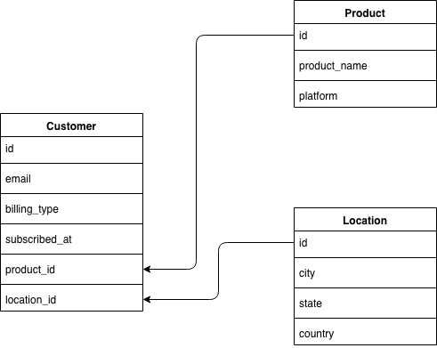
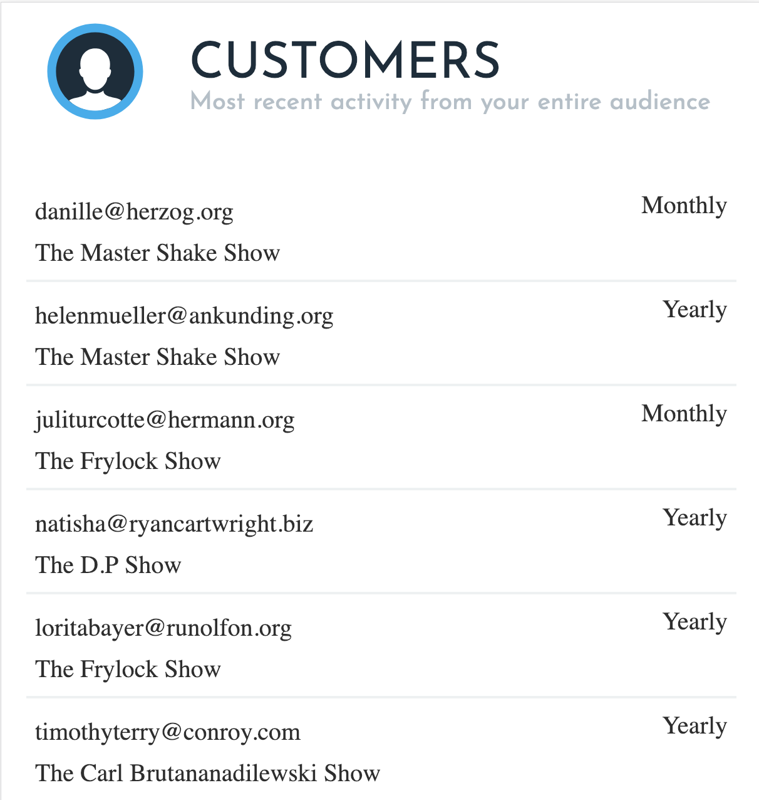
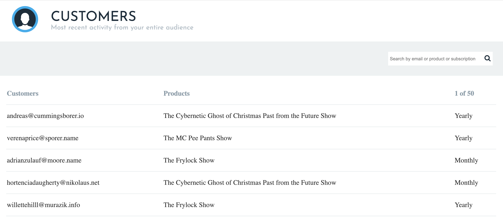
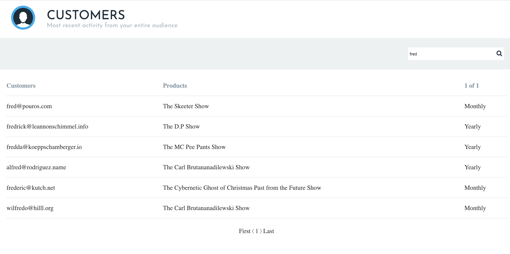

# :sparkles: :sparkles: Customer Subscriptions :sparkles: :sparkles:

## Usage :   

- This project was built, compiled, and tested on MacOS   
- Front End: React, Redux, redux-thunk, axios, semantic-ui-react 
- Back End: Ruby on Rails, Gems: fast_jsonapi, will_paginate, sqlite3 
- Prerequisites: webpack, yarn, ruby, git, homebrew    

## Installation :   

- Clone this repo and cd into it. Run:   
```bash   
   bundle install    
   ```      
- Migrate Database and Seed it
 ```bash   
   bundle exec rake db:migrate
   bundle exec rake db:seed
   ```     
- Start the rails server
```bash    
   rails s
   ```         
- From there, the application can be viewed by typing into the URL bar:  
```bash    
   localhost:3000
   ```     

## Backend :

- Consist of at least 3 ActiveRecord models:   

- Contain 2 routes only,  1 for the home page (existing), and 1  subscriptions api end point
- Return JSON format only using any serialization library: 
```bash     
   fast_jsonapi
   ```    
- Support api pagination using any pagination gem or library: will_paginate
```bash       
   will_paginate  
   ```   
- Contains a seed file that imports the sample_data.json file into the relational sqlite database.
- Has at least one test for the api endpoint: tested api endpoint using postman


## Front End :

- Mobile View:
   
- Tablet/Laptop View:   
   
- Be able to search the retrieved data and return the desired result on the UI:
  
