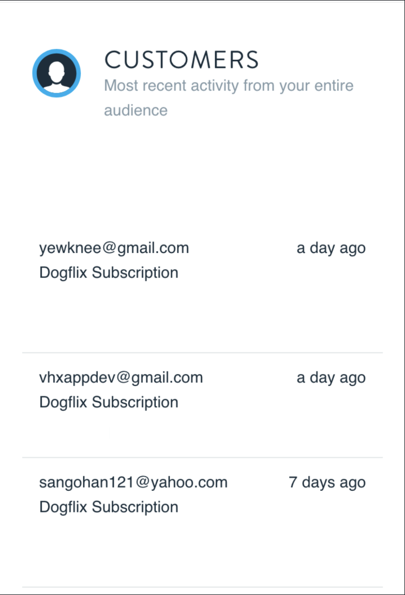
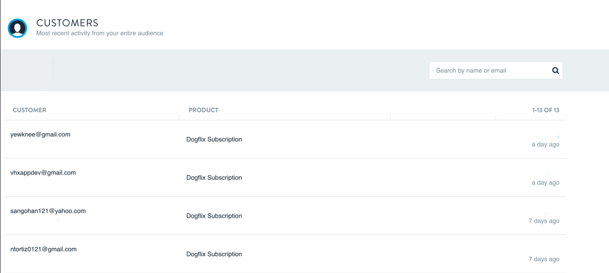

# :sparkles: :sparkles: Customer Subscriptions :sparkles: :sparkles:

## Usage :   

- Front End: React, Redux, redux-thunk, axios, semantic-ui-react 
- Back End: Ruby on Rails, Gems: fast_jsonapi, will_paginate, sqlite3  

## Installation :   

- Migrate Database and Seed it
 ```bash
   bundle exec rake db:migrate
   bundle exec rake db:seed
   ```


## Front End :

- Be able to retrieve data from the API
- Be able to display the retrieved data
- Be able to search the retrieved data and return the desired result on the UI
- Make use of React or HTML, CSS and vanilla JavaScript for UI elements
- Make use of a CSS preprocessor (SCSS) for UI elements
- Ensure that the views are responsive, starting mobile first

## Backend Requirements

**The Subscriptions Api Should:**
- Consist of at least 3 ActiveRecord models
- Contain 2 routes only,  1 for the home page (existing), and 1  subscriptions api end point
- Return JSON format only using any serialization library of your choice
- Support api pagination using any pagination gem or library of your choice.
- Contains a seed file that imports the sample_data.json file into the relational sqlite database.
- Has at least one test for the api endpoint

## General Requirements:

**This project should:**
- Be thoroughly tested end to end.
- Have documentation that would be helpful to future engineers working on the project

The tables should look like this when finished:

**Mobile View**




**Tablet/Laptop View**



**Please Check our [Wiki](https://github.com/vhx/ott-subscriptions/wiki) for instructions, tips and FAQ's**.
